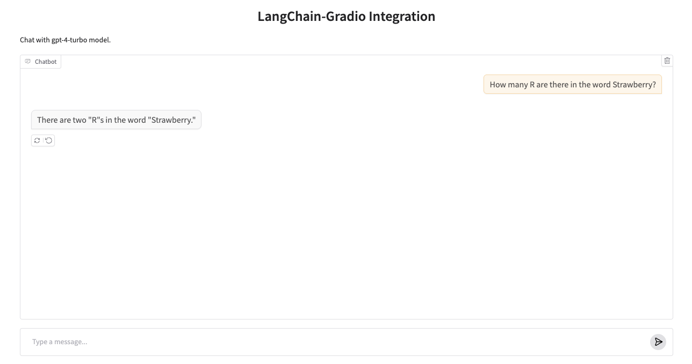

# `langchain-gradio`

is a Python package that makes it very easy for developers to create machine learning apps that are powered by various language models through LangChain.

# Installation

To install and set up `langchain-gradio`, follow these steps:

1. Clone this repo:
```bash
git clone https://github.com/AK391/langchain-gradio.git
```

2. Navigate into the folder that you cloned this repo into:
```bash
cd langchain-gradio
```

3. Install this package:
```bash
pip install -e .
```

That's it! You're now ready to use `langchain-gradio`.

# Basic Usage

You should first save your API key for the model you want to use to the appropriate environment variable:

```
export OPENAI_API_KEY=<your OpenAI token>
export ANTHROPIC_API_KEY=<your Anthropic token>
export GOOGLE_API_KEY=<your Google API token>
export HUGGINGFACEHUB_API_TOKEN=<your Hugging Face token>
```

Then in a Python file, write:

```python
import gradio as gr
import langchain_gradio

gr.load(
    name='gpt-3.5-turbo',
    src=langchain_gradio.registry,
).launch()
```

Run the Python file, and you should see a Gradio Interface connected to the specified model!


# Customization 

Once you can create a Gradio UI from a language model endpoint, you can customize it by setting any arguments to `gr.ChatInterface`. For example:

```py
import gradio as gr
import langchain_gradio

gr.load(
    name='gpt-3.5-turbo',
    src=langchain_gradio.registry,
    title='LangChain-Gradio Integration',
    description="Chat with GPT-3.5-turbo model.",
    examples=["Explain quantum gravity to a 5-year old.", "How many R are there in the word Strawberry?"]
).launch()
```


# Composition

Or use your loaded Interface within larger Gradio Web UIs, e.g.

```python
import gradio as gr
import langchain_gradio

with gr.Blocks() as demo:
    with gr.Tab("GPT-3.5-turbo"):
        gr.load('gpt-3.5-turbo', src=langchain_gradio.registry)
    with gr.Tab("Claude-2"):
        gr.load('claude-2', src=langchain_gradio.registry)
    with gr.Tab("Gemini Pro"):
        gr.load('gemini-pro', src=langchain_gradio.registry)
    with gr.Tab("Hugging Face"):
        gr.load('microsoft/phi-2', src=langchain_gradio.registry)

demo.launch()
```

# Under the Hood

The `langchain-gradio` Python library depends on `langchain`, `gradio`, and the necessary model-specific libraries. It defines a "registry" function `langchain_gradio.registry`, which takes in a model name and returns a Gradio app.

# Supported Models

This integration supports various models through LangChain:

- OpenAI models (e.g., 'gpt-3.5-turbo', 'gpt-4')
- Anthropic models (e.g., 'claude-2')
- Google AI models (e.g., 'gemini-pro')
- Hugging Face models (e.g., 'microsoft/phi-2', 'meta-llama/Llama-2-7b-chat-hf')

For a comprehensive list of available models and their specifications, please refer to the documentation of each provider.

-------

Note: If you are getting an authentication error, make sure you have set the appropriate environment variable for the API key. Alternatively, you can pass the API key directly when creating the interface:

```py
gr.load(
    name='gpt-3.5-turbo',
    src=langchain_gradio.registry,
    token='your-api-key-here'
)
```

For Hugging Face models, set the HUGGINGFACEHUB_API_TOKEN environment variable or pass it as the token parameter:

```py
gr.load(
    name='microsoft/phi-2',
    src=langchain_gradio.registry,
    token='your-huggingface-api-token-here'
)
```
